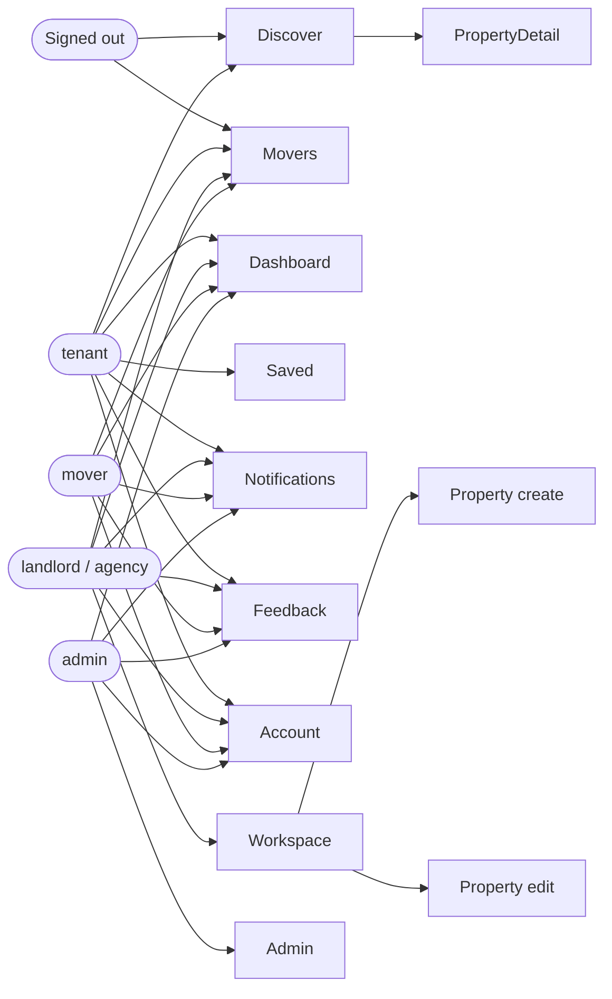
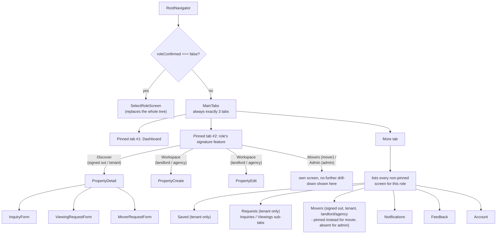

# Architecture

## Project structure

```text
.github/
├── workflows/
│   └── ci.yml
├── ISSUE_TEMPLATE/
└── dependabot.yml

backend/
├── config/
├── constants/
├── controllers/
├── docs/            openapi.js, the generated spec
├── jobs/            scheduled-job implementations (run via scripts/runScheduledJobs.js)
├── middlewares/
├── models/
├── routes/
├── scripts/         runScheduledJobs.js, backupDatabase.js, restoreDatabase.js, cleanupTestData.js
├── seeders/
├── services/
├── tests/
├── utils/
├── validators/
├── app.js
├── Dockerfile
├── Dockerfile.render   Render-only consolidated build (bundles the built frontend in) - see Deployment
├── eslint.config.js
├── instrument.js       Sentry.init(), imported first in server.js
└── server.js

frontend/
├── src/
├── tests/
├── Dockerfile
├── eslint.config.js
├── nginx.conf
├── index.html
├── package.json
└── styles.css

mobile/
├── src/
│   ├── api/            # apiFetch client + domain functions
│   ├── components/     # Shared UI (PropertyCard, MessageView, Skeletons)
│   ├── context/        # AuthContext, SettingsContext, ThemeContext (light/dark mode)
│   ├── navigation/      # Root stack, bottom tabs (2 pinned + More; roleTabs.js), per-tab stacks (incl. Movers, More stacks)
│   ├── screens/         # auth/, dashboard/, discover/, saved/, workspace/, movers/, requests/, notifications/, feedback/, account/, admin/, more/
│   ├── theme/           # Shared color tokens (mirrors frontend/styles.css; light + dark variants)
│   └── utils/           # Formatting helpers, contact.js (tel:/mailto:/wa.me link builders)
├── App.js
├── app.json
├── babel.config.js
├── eslint.config.js
├── jest.setup.js
└── README.md

docs/
├── compliance/          # legal/privacy/security - code-of-ethics.md, terms-of-service.md,
│                        # acceptable-use-policy.md, dispute-resolution-policy.md,
│                        # data-protection-policy.md, cookie-policy.md,
│                        # records-of-processing-activities.md, data-protection-impact-assessment.md,
│                        # incident-response-plan.md, records-retention-and-protection-policy.md,
│                        # database-access-policy.md, iso27001-statement-of-applicability.md,
│                        # soc2-readiness-assessment.md, risk.md, accessibility-statement.md,
│                        # Governance-and-Policies.md (the hub - mirrored to the wiki)
├── dev/                 # engineering/ops reference - API-Reference.md, Architecture.md,
│                        # Authentication.md, Deployment.md, Getting-Started.md, Testing.md,
│                        # Troubleshooting.md, devops.md, scaling-load-balancing.md,
│                        # kejaapp-insomnia.json (all but the last two mirrored to the wiki)
├── project/             # project status/meta - Roadmap.md, live.md, qa-qc-report.md,
│                        # demo-credentials.md, Features-and-User-Stories.md
│                        # (Roadmap.md and Features-and-User-Stories.md mirrored to the wiki)
├── user-manual/         # general + one manual per role - mirrored to the wiki
└── home.md, _Sidebar.md, _Footer.md, Keja-App.md   # wiki-navigation source pages,
                         # stay flat since they're GitHub-wiki chrome, not content

k8s/           Kubernetes manifests (see Deployment)
docker-compose.yml
```

See **[Governance and Policies](Governance-and-Policies)** for what each `docs/` policy document covers.

## Backend

**Application foundation**
- Express app split into `backend/app.js` (routes/middleware wiring) and `backend/server.js` (process entry point).
- Centralized environment loading/validation in `backend/config/env.js`.
- MongoDB connection helper with retry support and a "degraded startup" mode for local dev in `backend/config/db.js`.
- Health endpoints (overall status, liveness, readiness, DB-only) — see [Deployment](Deployment#health-checks).
- CORS, Helmet, Morgan logging, centralized async handling (`asyncHandler`), and a central error-handling middleware.
- Daily-rotated log files in `backend/logs/` (`access-YYYY-MM-DD.log`, `app-YYYY-MM-DD.log`), timestamped in Nairobi time (`Africa/Nairobi`, UTC+3, no DST). Disabled during tests, path configurable via `LOG_DIR`.
- Configurable API/auth rate limiting, Redis-backed when `REDIS_URL` is set (falls back to in-memory per-process limits otherwise).
- Response caching for public property/mover listings with immediate invalidation on writes; long-lived immutable `Cache-Control` on uploaded property images.
- OpenAPI JSON exposed for API tooling (`GET /api/docs/openapi.json`).

**Domains implemented**
- **Auth**: registration/login (email or user-chosen username), JWT + hashed refresh-token sessions, bearer + HTTP-only cookie support, password change, profile update. See [Authentication](Authentication).
- **Properties & pricing**: full property model (owner, location, price, amenities, images, contact details, lifecycle status), anonymous search with filters (rent range, location, type, viewing type, radius), owner CRUD, cost-summary enrichment, image upload (local disk or S3-compatible bucket via `STORAGE_DRIVER`), image fingerprinting for duplicate detection.
- **Saved properties (favorites)**: save/list/remove, duplicate-save guard, cost-summary enrichment on list.
- **Property inquiries**: tenant → owner messaging per property, response workflow (open/responded/closed), notifications on create/respond.
- **Viewing requests**: `scheduled` (needs a future date) and `open` (auto-approved) viewing types, status workflow (pending/approved/rejected/cancelled/completed), notifications.
- **Reviews & ratings**: tenant reviews with rating aggregation on the property, owner response, admin read-only moderation view, owners can't review their own listings.
- **Agency verification**: submission, status lookup, admin approve/reject with rejection reason, notifications. Approval also sets a public `verified` flag on the `User` account, surfaced as a "Verified agency" badge next to the owner on listings (web and mobile) — unverified agencies and all landlords keep listing normally, the badge just doesn't appear.
- **Admin moderation**: user search/filter, account status changes (active/suspended/banned) with audit history, admins are explicitly excluded from all listing-management role checks (they moderate users, not listings).
- **Notifications**: model + service layer funneling every notification through one `createNotification` chokepoint, list/mark-as-read (`unread=true` filter) plus a bulk `mark-all-read` (backs the notification-bell badge on web/mobile nav), triggered by inquiries, reviews, viewings, agency verification decisions, feedback responses, account status changes, and saved-search matches — plus four scheduled sweeps (see below) and a best-effort mobile push send on every notification. See the [Notifications](Features-and-User-Stories#notifications) user story.
- **Saved searches**: location + radius (plus optional price/type/bedroom/county/town) criteria saved per user; new listings are matched against every saved search on publish, reusing the same filter-building logic (`backend/utils/propertyFilters.js`) the property list endpoint already used, to avoid duplicating the geo-radius math.
- **Scheduled jobs**: standalone, idempotent scripts in `backend/jobs/` run via `backend/scripts/runScheduledJobs.js` (`npm run jobs`) — deliberately not an in-process timer, since a horizontally-scaled backend would have a timer fire once per replica. A Kubernetes `CronJob` runs them every 15 minutes on the `k8s/` path, but that path isn't the live deployment; **Render (the actual live deployment) has no Cron Job service configured, so these jobs currently don't run against production at all** — see `docs/project/Roadmap.md`'s Next section. Four sweeps: stale inquiry/viewing-request nudges (48h unanswered), upcoming-viewing reminders (24h out, both sides notified), post-viewing review prompts (also flips the viewing to `completed`), and stale-listing nudges (14 days live, zero inquiries).
- **Push notifications**: Expo's push service (`expo-server-sdk`), not raw Firebase/FCM — the idiomatic path for an Expo-managed mobile app. `DeviceToken` model + upsert/remove endpoints; `createNotification` best-effort sends a push to every registered device for the notification's recipient.
- **Trust & safety**: property image fingerprinting, duplicate-image violation records, admin violation review, automatic ban on the 4th active violation.
- **Platform feedback**: tenants/landlords/agencies/movers submit feedback, only admins respond, responding immediately publishes it as a public testimonial. See the [Platform Feedback](Features-and-User-Stories#platform-feedback) user story.
- **Movers**: `mover` is a full user role (self-registers like tenant/landlord/agency); a `Mover` business-directory document links to that account plus a GeoJSON `location.coordinates` (2dsphere) for proximity search. `MoverVerification` mirrors agency verification exactly (admin approve/reject, syncs `Mover.verified`). Landlords/agencies manage trusted affiliates (`Mover.affiliatedOwners`); `GET /api/properties/:id/movers` returns a property's affiliated movers plus verified movers within a radius, deduplicated. `MoverRequest` (modeled on `Inquiry`) handles the tenant → mover service-request lifecycle (create, accept/decline/complete, cancel), with notifications on create and every status change. Public listing endpoint supports filters for service type, county, rating, base price, and proximity. Optionally captures the tenant's device location (`pickupLat`/`pickupLng`) at request time; a `haversineDistanceKm` util (`backend/utils/propertyFilters.js`) computes the pickup-to-dropoff distance against the destination property's coordinates on every response, rather than storing it, so it can't go stale.
- **Support KejaApp (voluntary M-Pesa)**: a service charge paid directly to the app's own developer/shortcode, deliberately outside the inter-user Payment Boundary (see `CLAUDE.md`) — never routes money between tenants/landlords/agencies/movers. `POST /api/support-payments` (Daraja OAuth + STK push) and `POST /api/support-payments/callback` (Safaricom's own webhook, idempotent). Same "empty = disabled" convention as VAPID/Sentry: all five `MPESA_*` env vars required or the endpoint 503s. See [Payments](Payments).

**Developer workflow**
- Demo seed script: `backend/seeders/seedDemoData.js`.
- Username backfill script (for accounts predating the username feature): `backend/seeders/backfillUsernames.js`.
- Scheduled-jobs runner: `backend/scripts/runScheduledJobs.js` (`npm run jobs`).
- Insomnia collection: `docs/kejaapp-insomnia.json`.
- Opt-in real-MongoDB integration tests via `TEST_MONGODB_URI` — see [Testing](Testing).

## Web frontend

The web frontend (`frontend/`) is a React 19 + Vite single-page app with **manual routing** — no react-router. `window.history.pushState` plus a small `resolveViewFromPath`/`getViewPath` pair in `app-utils/` handle navigation.

**Key files**
- `src/App.jsx` — top-level component: header, nav, the sign-in/register modal, and a `renderCurrentPage()` switch over the current view.
- `src/pages/` — one component per view: `LandingPage`, `DashboardPage`, `DiscoverPage`, `SavedPage`, `WorkspacePage`, `PropertyEditPage`, `PropertyCreatePage`, `AdminPage`, `NotificationsPage`, `FeedbackPage`, `MoversPage`, `AccountPage`, plus a few standalone pages (`PropertyDetailPage`, `DataProtectionPage` — serves both `/privacy` and `/data-protection`, `PrivacyPage` was consolidated into it — `TermsPage`, `DeleteAccountPage`, `SelectRolePage`, `SupportPage` — the voluntary M-Pesa "Support KejaApp" page, see `Payments.md` — `NotFoundPage`).
- `src/components/PropertyForm.jsx` — shared create/edit form fields, used by both `PropertyCreatePage` and `PropertyEditPage`.
- `app-utils/` (repo root of `frontend/`) — the "everything else" module set, split by concern: `client.js` (`apiFetch` wrapper, CSRF token handling, view-routing helpers), `api.js` (every domain-specific API helper — `fetchProperties`, `loginUser`, `createFeedback`, etc.), `access.js` (role/access-control helpers — `canAccessView`, `canManageListings`), plus `format.js`/`misc.js`. An in-memory request cache with TTL + prefix-based invalidation lives in `client.js` (`getCached`/`setCached`/`clearRequestCache`). `app-utils.js` (no trailing directory) still exists alongside it as a ~10-line barrel re-exporting all five, kept only so pre-existing imports/mocks of the old flat-file path keep working.

**Access model**
- Anonymous visitors can search available listings and open full property details (prompted to sign in first) without signing in.
- Tenants: search, open any listing's full details, save/unsave, submit feedback, no listing-management access anywhere.
- Landlords/agencies: cannot browse the general Discover list at all (only their own listings, via Workspace) — and if they land on a property detail page directly (e.g. a shared link), they only see full details for listings they own; another owner's listing shows a "manage your own listings from the Workspace tab" message instead. Also manage mover affiliates on the Movers tab.
- Movers: excluded from property listings/detail pages entirely (framed as transportation facilitators who work from requests/notifications) — see their own profile/received-requests dashboard on the Movers tab instead of the directory everyone else sees there.
- Admins: user management console only — no listing creation/editing capability anywhere in the app or API, though they can still open a property detail page directly (this is enforced on the backend for creation/editing, and on the frontend for the ownership/role checks above).

**Caching**: several `fetch*` helpers in `app-utils/api.js` cache their result in-memory for 15–60 seconds (see the full list in [Scaling & Load Balancing](scaling-load-balancing.md#caching)) to avoid redundant refetches on remount. Writes invalidate the relevant cache prefix; login/logout/register/account-deletion clear everything.

**Navigation flow**, per role (`canAccessView`/`roleViewAccess` in `app-utils/access.js`):



Always reachable regardless of role or sign-in state (not shown above, no nav entry): `privacy`/`terms`/`data protection`, `delete account`, `select role` (forced once when `roleConfirmed` is `false`), and `support` (Support KejaApp — signed-in only, prompts sign-in otherwise). `property detail` is also directly reachable by every role except `mover` and signed-out visitors without an active property.

## Mobile app

See **[Mobile App](Keja-App)** for the full picture — Expo setup, running on a device/emulator, pointing it at your backend, and known gaps versus the web frontend.

**Navigation structure** (`RootNavigator.js` → `MainTabs.js`, `roleTabs.js`): the bottom tab bar is always exactly 3 tabs — two role-specific tabs pinned, plus a **More** tab that pushes every other role-visible screen as a menu instead of consuming its own bar slot:



Same screens are reused whether reached via a pinned tab or through More — `MoversScreen`, for example, renders the tenant/owner-facing directory or the mover's own profile/requests dashboard depending on role, regardless of which nav path got there. `mover` and signed-out visitors are excluded from Discover/property-detail entirely (movers work from requests/notifications instead); only `tenant` gets the Saved and Requests tabs; only `landlord`/`agency` gets Workspace; only `admin` gets the Admin tab.
