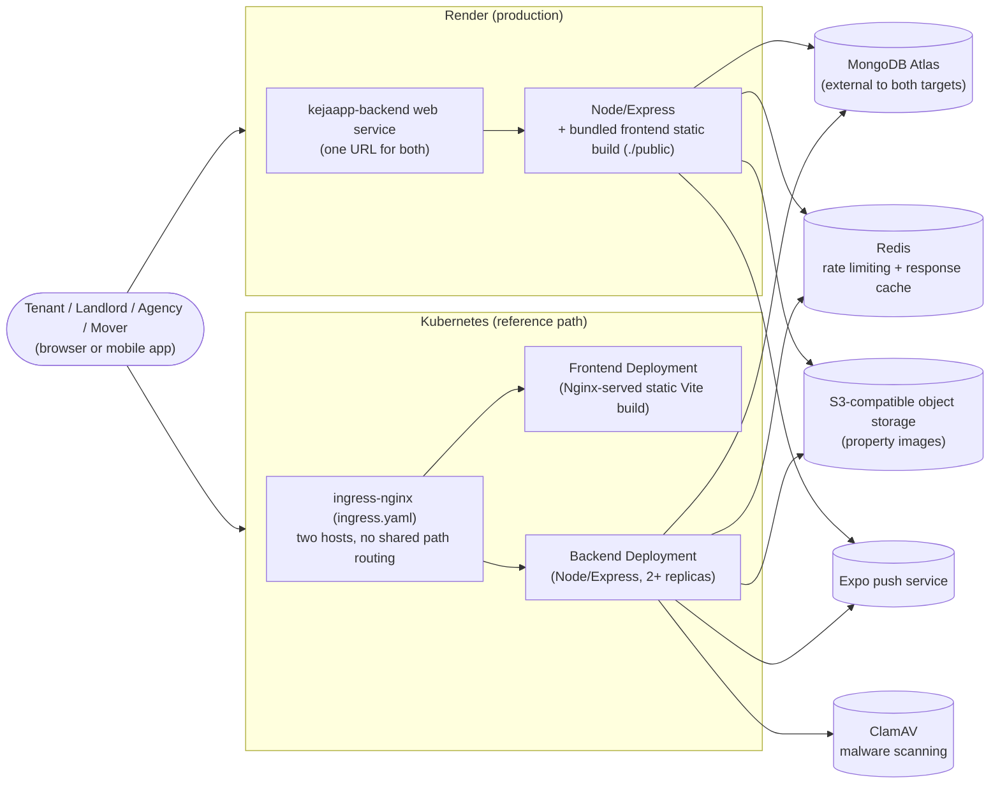

# DevOps

## CI

`.github/workflows/ci.yml` had been disabled at the GitHub Actions level (`state: disabled_manually`) since 2026-07-06 as a billing-notification precaution. Re-enabled via `gh workflow enable`, but the workflow still isn't actually completing: every job fails immediately with "The job was not started because your account is locked due to a billing issue" (confirmed 2026-08-06, PR #196). That's a separate, account-level GitHub billing lock — not something a workflow or code change can fix — and needs to be cleared at [github.com/settings/billing](https://github.com/settings/billing) before any of this actually runs again. See the [ISO 27001 SoA](../compliance/iso27001-statement-of-applicability.md) for the fuller history.

Once unblocked, it runs the following jobs:

- **backend** job: spins up a `mongo:7` service container, runs `npm test` against it (this also exercises `backend/tests/integration/mongodb.integration.test.js`, which otherwise self-skips without `TEST_MONGODB_URI`).
- **frontend** job: runs `npm test`, then `npm run build` to catch build-breaking errors.
- **mobile** job: `npm run lint` then `npm test`. Runs independently in parallel with the two above — it isn't in `docker`'s `needs:` list, so a mobile-only failure doesn't block the backend/frontend images from building or publishing.
- **docker** job: builds the backend and frontend images (`docker build`, no push) to catch Dockerfile regressions, gated on the **backend** and **frontend** jobs passing (not **mobile** — see above).
- **k8s-smoke-test** job: gated on **docker** passing. Spins up a real `kind` cluster, installs `ingress-nginx`, builds and loads the backend/frontend images straight into the cluster (no registry round-trip), applies the `k8s/` manifests (with a throwaway in-cluster MongoDB standing in for Atlas), and verifies the whole stack through the ingress end-to-end: health check, register, create a property, confirm it's publicly discoverable. This is the CI job that actually proves the `k8s/` manifests work together, not just that they build.
- **publish** job: on pushes to `main` only (not PRs), gated on **docker** and **k8s-smoke-test** passing. Rebuilds both images and pushes them to GHCR (`ghcr.io/<owner>/jakezapp-backend`, `jakezapp-frontend`), tagged `latest` and the commit SHA. This is what the Kubernetes manifests in `k8s/` deploy — see "Deployment (Kubernetes)" below. Render doesn't use these; it builds directly from the Dockerfiles itself.

## Containers

- `backend/Dockerfile` — Node 22 Alpine, production dependencies only, non-root working dir, `HEALTHCHECK` against `GET /api/health/live`. Used by `docker compose`, the CI `docker`/`k8s-smoke-test`/`publish` jobs, and Kubernetes — every two-origin path.
- `frontend/Dockerfile` — multi-stage: Node 22 Alpine builds the Vite bundle, then Nginx Alpine serves the static output. `frontend/nginx.conf` handles SPA routing (`try_files ... /index.html`) and long-cache headers for hashed `/assets/`. Same audience as above.
- `backend/Dockerfile.render` — Render-only, bundles the built frontend into the backend image (see "Deployment (Render)" below for why); not used by anything else.
- `docker-compose.yml` (repo root) — wires `mongo`, `redis`, `clamav`, `backend`, and `frontend` together for a full local stack: `backend` talks to `mongo`/`redis`/`clamav` by service name, `frontend` is built with `VITE_API_BASE_URL` pointing at the host-exposed backend port. `clamav` (`clamav/clamav:stable`) provides malware scanning on property-image uploads (`backend/services/malwareScanService.js`) — it isn't exposed to the host, only reachable from `backend` on the compose network, and its signature database persists in the `clamav-data` volume so it isn't re-downloaded on every `docker compose up`.

Run the full stack:

```bash
cp .env.example .env   # set JWT_SECRET
docker compose up --build
```

- Frontend: `http://localhost:8080`
- Backend: `http://localhost:5000`

This is meant for local/staging use as-is (single backend replica, no TLS termination). It is a reasonable starting point for a real deployment but isn't hardened for one (see below).

## Health checks

Already implemented in `backend/routes/healthRoutes.js` / `backend/controllers/healthController.js`, reused by the Docker `HEALTHCHECK` and useful behind any load balancer or orchestrator:

- `GET /api/health` — overall status + current DB connection state.
- `GET /api/health/live` — liveness only (process is up), no DB check. Used by the container `HEALTHCHECK`.
- `GET /api/health/ready` — readiness: actively pings MongoDB, returns `503` if it's unreachable. Point a load balancer's health check here to pull an instance out of rotation during a DB outage.
- `GET /api/health/database` — DB connectivity only.

## Backups and disaster recovery

MongoDB Atlas's built-in Cloud Backup (scheduled snapshots) only exists on M10+ dedicated clusters, not on the free M0 shared tier this project runs on - so `backend/scripts/backupDatabase.js`/`restoreDatabase.js` are a self-hosted alternative rather than something to enable in the Atlas dashboard.

**What it does**: dumps every collection (via the Mongo driver directly, not the `mongodump` binary - no extra system dependency to install anywhere this runs) to a single gzip-compressed EJSON document (`bson`'s `EJSON.stringify(..., { relaxedMode: false })`, which round-trips `ObjectId`/`Date`/etc. exactly, not just as plain strings), and uploads it to a **separate, private** S3-compatible bucket.

**Why a separate bucket from `S3_BUCKET`**: that bucket is public-read by design (property photos need to be publicly viewable). A database dump contains password/refresh-token hashes and PII - it must never land somewhere publicly downloadable. Create a second, private (not public-read) bucket and set the `BACKUP_S3_*` vars in `backend/.env`/on Render (same "empty = disabled" convention as `REDIS_URL`/`CLAMAV_HOST`/etc. - both scripts refuse to run, rather than silently no-op, since they're always explicitly invoked by a human):

```
BACKUP_S3_BUCKET=
BACKUP_S3_REGION=auto
BACKUP_S3_ENDPOINT=
BACKUP_S3_ACCESS_KEY_ID=
BACKUP_S3_SECRET_ACCESS_KEY=
```

**Running a backup**: `npm run backup` in `backend/` - connects to `MONGODB_URI`, uploads to `s3://$BACKUP_S3_BUCKET/backups/<ISO timestamp>.json.gz`.

**Running a restore**: `npm run restore` defaults to a dry run against the newest backup in the bucket - prints the source key, the target `MONGODB_URI` host/db, and a per-collection document-count preview, without touching anything. Add `-- --confirm` to actually wipe and replace each collection with the backup's contents. Pass `-- --key=<key>` to restore a specific backup instead of the newest one.

**Verified with a real drill, not just written and trusted**: seeded a scratch local MongoDB instance with known data, ran `npm run backup` against it (real upload to the private B2 bucket, confirmed present via the bucket's own list API), dropped the entire scratch database (simulating real data loss), then ran `npm run restore -- --confirm` and confirmed every document came back byte-for-byte identical, including `ObjectId`/`Date` type fidelity (`instanceof` checks in `mongosh`, not just a JSON string comparison). The drill's scratch database and backup object were both deleted afterward - only the scripts and this documentation are left behind.

**What this doesn't cover yet**: it's a manual, on-demand procedure, not an automated schedule. Real automation was considered and deliberately deferred rather than half-wired:
- **Render Cron Jobs** would be the simplest trigger, but aren't free (from $1/mo) - a real recurring cost that wasn't approved.
- **A GitHub Actions `schedule:` workflow** would be free (this repo is public), but depends on the account-level GitHub billing lock (see [CI](#ci) above) actually being cleared, which was last confirmed 2026-07-23 and hasn't been rechecked since.
- **A Kubernetes `CronJob`** (mirroring `backend-cronjob.yaml`'s existing pattern for `npm run jobs`) would work today with zero new infrastructure, but only matters once `k8s/` is an actually-deployed target rather than the reference/alternative path it is now.

No bucket lifecycle/retention rule is configured either - old backups accumulate until manually deleted or a lifecycle rule is added in the B2 bucket's own settings.

## Deployment (Render) — production

This is the actual live deployed instance: `kejaapp-backend-7iu3.onrender.com` — the one URL for both the web app and its API (still named `kejaapp-backend` post-JakezApp-rebrand - Render doesn't change a service's `.onrender.com` URL on a rename, and this is an internal infrastructure detail invisible to users of the actual branded app; see `docs/project/CHANGELOG.md`'s rebrand entry). `render.yaml` (repo root) is a [Render Blueprint](https://render.com/docs/blueprint-spec) that defines the whole stack:

- **kejaapp-backend** — a single web service built from `backend/Dockerfile.render` (**not** the plain `backend/Dockerfile` — see below), with `dockerContext: .` (the repo root, not `backend/`, since this build needs to reach into `frontend/` too). Render injects `PORT` itself; `backend/config/env.js` already reads `process.env.PORT`, so no code change was needed.
- **kejaapp-redis** — Render's managed Key Value (Redis-compatible) service, wired into the backend via `REDIS_URL`.

There used to be a separate **kejaapp-frontend** static site here. It was retired, not renamed: `backend/Dockerfile.render` is a three-stage build (see the file itself) that builds the frontend in its own stage and copies the output into the final image as `./public`; `backend/app.js` serves it directly (`express.static` + an SPA fallback route) whenever that directory is present, and falls back to today's plain JSON status message when it isn't (local dev, `docker compose`, and the Kubernetes path below never have it, so they're unaffected). This makes the web app and its API genuinely same-origin, closing out the reason the CSRF token used to need relaying through response bodies instead of a plain cookie (see `CHANGELOG.md`'s "Consolidate Web + API onto One Render Origin" entry) — `docker compose` and Kubernetes are still two-origin setups on purpose and keep using the original `backend/Dockerfile`/`frontend/Dockerfile` unchanged.

Three things this consolidation actually needed, beyond just bundling the files together (all found by testing the built image locally before trusting it in production — worth doing again if this ever gets re-architected):

- **`VITE_API_BASE_URL`/`VITE_GOOGLE_CLIENT_ID` are Docker build args, not just runtime env vars** — Vite bakes them into the JS bundle at `npm run build` time. `backend/Dockerfile.render`'s frontend-build stage declares matching `ARG`s; Render passes a Docker-runtime service's `envVars` through as build args too, which is what makes this work without extra Blueprint config.
- **`CORS_ORIGIN` is still required, even though everything's same-origin now** — Vite's build emits `crossorigin` on the module `<script>`/stylesheet `<link>` tags, which makes the browser send a real `Origin` header (CORS mode) for these requests despite being same-origin. `render.yaml` points it at the service's own URL.
- **Helmet's default Content-Security-Policy blocks the Google Identity Services script** (`frontend/index.html`'s `<script src="https://accounts.google.com/gsi/client">`) — the frontend never had a CSP before (it was a header-less static site). `app.js` only applies a loosened CSP (adding `accounts.google.com` to `script-src`/`connect-src`/`frame-src`) when it detects it's actually serving the bundled frontend, so nothing else is affected.

No ClamAV service is defined here — it's the one piece of the stack (docker-compose/Kubernetes) that isn't free to run (its signature database needs roughly 1-2GB of RAM, well past the free plan's 512MB), so this Blueprint deliberately leaves `CLAMAV_HOST` unset and lets `malwareScanService.js`'s existing "empty = disabled" convention silently skip scanning on this path. Add a `pserv` service running `clamav/clamav:stable` on a paid plan, wired via `CLAMAV_HOST`/`CLAMAV_PORT`, if you want scanning back.

MongoDB is **not** provisioned by the blueprint — Render has no managed MongoDB, so this stays on the existing MongoDB Atlas instance (or whatever `MONGODB_URI` you already use).

### First-time setup

1. In the Render dashboard: **New > Blueprint**, point it at this repo. Render reads `render.yaml` and creates both services.
2. Set the one secret the blueprint deliberately leaves blank: `MONGODB_URI` on **kejaapp-backend** (Atlas connection string, including credentials). `JWT_SECRET` is auto-generated by Render; everything else has a value in `render.yaml`.
3. Create an object storage bucket for property images (see "Object storage" below) and set the five `sync: false` secrets on **kejaapp-backend**: `S3_BUCKET`, `S3_ENDPOINT`, `S3_ACCESS_KEY_ID`, `S3_SECRET_ACCESS_KEY`, `S3_PUBLIC_BASE_URL`.
4. Deploy. Once the service is up, confirm both the page and its API work from the same URL (check the browser console/network tab for CORS or CSP errors) — `CORS_ORIGIN`/`VITE_API_BASE_URL` in `render.yaml` assume the default service name `kejaapp-backend`. If Render assigns a different subdomain (name already taken, custom domain, etc.), update both to match and redeploy.

### Object storage

Render web services have no persistent disk on the free plan (and only one disk per paid instance, which doesn't survive across multiple instances either) — anything written to `backend/uploads` disappears on the next restart or deploy. `backend/services/fileStorageService.js` supports two drivers, switched by `STORAGE_DRIVER`:

- `local` (default) — writes to `UPLOAD_DIR` on disk. Used by `docker compose` and local dev; fine there because the volume/filesystem persists.
- `s3` — writes to any S3-compatible bucket via `@aws-sdk/client-s3`. This is what `render.yaml` sets for **kejaapp-backend**.

The `s3` driver isn't tied to AWS — it works with any S3-compatible provider by pointing `S3_ENDPOINT` at it. **Cloudflare R2** is the recommended default for this project: free tier includes 10 GB storage and no egress fees (egress is what most providers charge for on image-heavy apps like this one).

Setup for R2:

1. Create a bucket in the Cloudflare dashboard (R2 > Create bucket).
2. Enable public access on the bucket (R2 > bucket > Settings > Public Access) and note the `r2.dev` public URL (or attach a custom domain) — this is `S3_PUBLIC_BASE_URL`.
3. Create an API token (R2 > Manage API Tokens > Create API Token, "Object Read & Write", scoped to the bucket) — gives you `S3_ACCESS_KEY_ID` / `S3_SECRET_ACCESS_KEY`.
4. `S3_ENDPOINT` is `https://<account-id>.r2.cloudflarestorage.com`; `S3_BUCKET` is the bucket name; `S3_REGION` stays `auto` (R2 ignores region but the AWS SDK requires the field).

AWS S3, Backblaze B2, and MinIO all work the same way — swap in their endpoint/credentials and (for MinIO/path-style-only providers) set `S3_FORCE_PATH_STYLE=true`.

Note: `removePropertyImage` now deletes the underlying object (or local file) when a property image is removed, for either driver — previously images were only detached from the Property document and the file was left orphaned on disk.

### Error tracking (Sentry)

`backend/instrument.js` calls `Sentry.init()` if `SENTRY_DSN` is set, then `backend/app.js` wires `Sentry.setupExpressErrorHandler(app)` between `notFound` and the app's own `errorHandler` — Sentry only reports errors that would already reach `errorHandler` with a 5xx status (its default `shouldHandleError` matches the same threshold `errorMiddleware.js` already logs at), so nothing changes about which errors are treated as noteworthy, only where they're also reported.

Same "empty = disabled" convention as `REDIS_URL`/`CLAMAV_HOST`/`GOOGLE_CLIENT_ID`: leave `SENTRY_DSN` unset and errors are only logged locally (`backend/utils/logger.js`), same as before this was added.

Setup: create a project at [sentry.io](https://sentry.io) (Node/Express platform), copy its DSN, set `SENTRY_DSN` on **kejaapp-backend**.

Mobile carries the same convention independently: `mobile/App.js` calls `Sentry.init()` if `EXPO_PUBLIC_SENTRY_DSN` is set (a separate Sentry project, "react-native" platform), and wraps the root `App` component with `Sentry.wrap()` for crash reporting. Source-map upload for readable stack traces (via `mobile/metro.config.js`'s `getSentryExpoConfig` and a `SENTRY_AUTH_TOKEN`) is deliberately not wired yet — only relevant once mobile does standalone EAS builds, not for local/Expo Go testing.

### Known limitations of this setup

- **Free plan**: the web service spins down after 15 minutes idle (cold start on the next request). With the `s3` driver this no longer affects uploaded images (see above), only request latency after an idle period. This Blueprint (backend+frontend + Redis) is fully free as configured — malware scanning is the one feature deliberately left off this path (see above) rather than a hidden cost.
- Single backend instance — no horizontal scaling. The existing Redis-backed rate limiting (`backend/config/env.js`'s `redisUrl`) already supports multiple instances if you do scale up.
- Render auto-deploys on push to the connected branch by default; there's no GitHub Actions deploy step to maintain, but it also means a red CI run on `main` doesn't block Render from deploying. If that's undesirable, disable auto-deploy in the Render dashboard and trigger deploys manually instead.

## Deployment (Kubernetes) — reference/alternative

`k8s/` (repo root) is a reference deployment path, not currently deployed anywhere — plain manifests (no Helm/Kustomize), for anyone who wants a real cluster instead of Render. It targets any conformant cluster (EKS, GKE, AKS, DigitalOcean, kind, minikube), not a specific provider. CI's **k8s-smoke-test** job keeps these manifests proven to actually work together (not just build) on every push/PR, even though nothing runs on them in production today.

Files:

- `namespace.yaml` — the `jakezapp` namespace everything else lives in.
- `backend-configmap.yaml` — non-secret backend env vars (CORS origin, S3 bucket/endpoint, in-cluster Redis/ClamAV addresses, etc.).
- `backend-secret.example.yaml` — template for the one Secret the backend needs (`MONGODB_URI`, `JWT_SECRET`, `S3_ACCESS_KEY_ID`, `S3_SECRET_ACCESS_KEY`). Copy to `backend-secret.yaml` (gitignored) and fill in real values before applying — never commit the filled-in version.
- `backend-deployment.yaml` — Deployment (2 replicas) + Service, wired to the ConfigMap/Secret via `envFrom`, with `livenessProbe`/`readinessProbe` on the existing `/api/health/live` and `/api/health/ready` endpoints.
- `backend-hpa.yaml` — HorizontalPodAutoscaler (2-6 replicas, scales on CPU). Requires `metrics-server` in the cluster.
- `frontend-deployment.yaml` — Deployment (2 replicas) + Service for the Nginx-served static build.
- `redis-statefulset.yaml` — in-cluster Redis (StatefulSet + 1Gi PVC on the cluster's default StorageClass) for rate limiting/caching. Not used for data that needs to survive losing the whole cluster.
- `clamav-statefulset.yaml` — in-cluster ClamAV (StatefulSet + 2Gi PVC, so the ~100MB signature database isn't re-downloaded on every pod restart) for malware scanning on property-image uploads (`backend/services/malwareScanService.js`). A cold signature-load takes roughly 10s in local testing, hence the readiness probe's `initialDelaySeconds: 30`; scanning fails closed (rejects the upload) if the backend can't reach it, rather than silently skipping the check, so a slow/crashed ClamAV pod shows up as upload failures, not a silent gap.
- `backend-cronjob.yaml` — CronJob running `node scripts/runScheduledJobs.js` (the time-based notification sweeps: stale inquiry/viewing nudges, viewing reminders, etc. — see `backend/jobs/`) every 15 minutes, reusing the same backend image/ConfigMap/Secret. `concurrencyPolicy: Forbid` guarantees exactly one run at a time regardless of how many `jakezapp-backend` Deployment replicas are up, so a naive in-process `setInterval` (which would fire once per replica and double-send notifications) was deliberately avoided. Each job is also idempotent on its own (it marks the records it's already acted on), so an overlapping or re-run is harmless even without the concurrency guard. Each sweep's threshold (48h nudge, 24h reminder, 14-day freshness/lookback windows) is an env var (`STALE_NUDGE_THRESHOLD_HOURS`, `VIEWING_REMINDER_WINDOW_HOURS`, `STALE_LISTING_FRESHNESS_DAYS`, `REVIEW_PROMPT_LOOKBACK_DAYS` — see `backend/.env.example`) — add them to the ConfigMap to retune cadence without a code change.
- `ingress.yaml` — routes two hosts to the two Services. Assumes `ingress-nginx` is installed; no TLS/cert-manager wired up (same "left for later" posture as the Docker Compose stack).

MongoDB stays external on Atlas, same as the Render setup — there's no in-cluster MongoDB manifest.

### Why two Ingress hosts, not one with path-based routing

`frontend/src/App.jsx` reads `VITE_API_BASE_URL` at **build time** (baked into the static JS bundle by Vite), not at container start. A single shared host with `/api` path routing would need the frontend to call a relative URL instead, which isn't how the code is written today. Rather than change frontend code for this, `ingress.yaml` keeps the same two-domain shape already used for Render (`jakezapp.example.com` for the frontend, `api.jakezapp.example.com` for the backend) — no app code changes, just infra.

The practical consequence: the `publish` CI job's frontend image is baked for `https://api.jakezapp.example.com` specifically. If you use that exact placeholder domain (pointed at your Ingress), the published image works as-is. For your own domain, rebuild and push the frontend image yourself:

```bash
docker build --build-arg VITE_API_BASE_URL=https://api.<your-domain> -t ghcr.io/<owner>/jakezapp-frontend:latest ./frontend
docker push ghcr.io/<owner>/jakezapp-frontend:latest
```

then update `CORS_ORIGIN` in `backend-configmap.yaml` to match your frontend domain.

### Capacity planning

`backend-hpa.yaml` scales the backend 2-6 replicas on CPU, and the thresholds haven't been revisited since they were first set. Review them against real usage on a recurring basis (quarterly is a reasonable default for a project this size) — check actual CPU/memory utilization against the HPA's target, whether 6 replicas has ever actually been hit, and whether ClamAV's/Redis's own resource requests (`clamav-statefulset.yaml`, `redis-statefulset.yaml`) still match their real footprint. There's no dashboard or reminder wired up for this yet — it's a manual, calendar-driven check, tracked here as the process itself rather than as tooling.

### Network topology

The two deployment targets are no longer the same shape — the Render consolidation (see "Deployment (Render)" above) made Render genuinely single-origin, while Kubernetes deliberately stays a two-origin setup with its own `frontend`/`backend` Deployments and two ingress hosts:



Not shown: the `backend-cronjob.yaml` CronJob, which talks to the same Mongo/notification path as the Kubernetes backend Deployment but isn't reachable from outside the cluster at all — it has no Service, only scheduled internal execution. Deliberately no `RenderApp --> ClamAV` edge either — malware scanning isn't wired up on Render at all (see "Known limitations of this setup" below), only in the Kubernetes path (`clamav-statefulset.yaml`); an earlier version of this diagram incorrectly drew that edge on both targets. This diagram (control `8.20`/`8.22` in the [ISO 27001 SoA](../compliance/iso27001-statement-of-applicability.md)) documents the intended topology; the Kubernetes half hasn't been cross-checked against a live running cluster's actual `kubectl get all` output. It was corrected during a compliance pass after drifting out of date following the Render consolidation — it previously showed Render with a separate static-site host and a shared Nginx-served frontend box, neither of which has been true since `kejaapp-frontend` was retired.

### First-time setup

1. Point DNS for both hosts in `ingress.yaml` at your ingress controller's load balancer IP/hostname (or edit the hosts to your own domain — see above).
2. Install `ingress-nginx` and (optionally) `metrics-server` in the cluster if they aren't already there.
3. Create an object storage bucket (see the Render section's "Object storage" above — same `STORAGE_DRIVER=s3` setup applies) and a MongoDB Atlas connection string.
4. Make the images pullable: after the CI `publish` job's first run, set the GHCR packages (`jakezapp-backend`, `jakezapp-frontend`) to public in GitHub's package settings, or add an `imagePullSecrets` entry to the Deployments for private pulls.
5. `cp k8s/backend-secret.example.yaml k8s/backend-secret.yaml`, fill in real values, then apply everything:

   ```bash
   kubectl apply -f k8s/namespace.yaml
   kubectl apply -f k8s/backend-configmap.yaml -f k8s/backend-secret.yaml
   kubectl apply -f k8s/backend-deployment.yaml -f k8s/backend-hpa.yaml
   kubectl apply -f k8s/backend-cronjob.yaml
   kubectl apply -f k8s/redis-statefulset.yaml
   kubectl apply -f k8s/frontend-deployment.yaml
   kubectl apply -f k8s/ingress.yaml
   ```

   Outside Kubernetes (local dev, Render, Docker Compose), run the same sweeps manually or via your own scheduler with `npm run jobs` in `backend/` (or `node scripts/runScheduledJobs.js` directly) — there's no in-process timer, so nothing runs automatically unless something external calls this on a schedule.

### Known limitations of this setup

- No TLS — add cert-manager plus `tls:` blocks in `ingress.yaml` before using this for anything beyond a demo.
- Deployments don't set a `securityContext`/`runAsNonRoot`; neither Dockerfile creates or switches to a non-root user, so forcing one at the pod level would just fail to start. Hardening this means updating the Dockerfiles first.
- No CI-driven rollout — applying `k8s/` is manual (`kubectl apply` / `kubectl rollout restart`), unlike Render's auto-deploy-on-push. Wiring up `kubectl apply` as a CI step (with cluster credentials as a repo secret) is a natural next step once a real cluster is chosen.
