# KejaApp — Workflow Screens

A visual walkthrough of KejaApp's key workflows, both platforms, captured live from a running local instance (not mockups). Meant as a companion to [`Architecture.md`](../dev/Architecture.md)'s navigation-flow diagrams — this shows what those diagrams actually look like on screen.

**Scope**: the representative path through each major feature, for both platforms, not an exhaustive screen-by-screen catalog. See `Architecture.md`'s Mermaid diagrams for the complete role→screen access map.

**How these were captured**: web screenshots via a headless browser against the local dev server (`localhost:5173` + `localhost:5000`), signed in as each of the 5 seeded demo accounts (see `demo-credentials.md`). Mobile screenshots via Expo's web preview (`react-native-web`, served by Metro at `localhost:8081`) — the real mobile codebase rendered in a browser, not a separate mockup. See **Known limitations** at the end for what this method couldn't capture and why.

---

## Web

### Landing → sign up / sign in

Signed-out visitors land here. "Sign in" opens a modal with both Sign in and Register tabs.

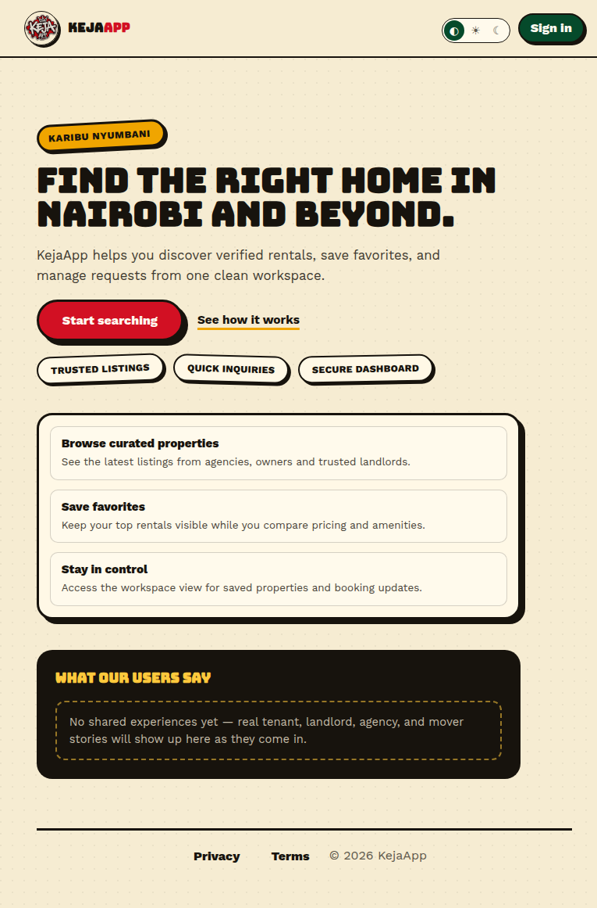
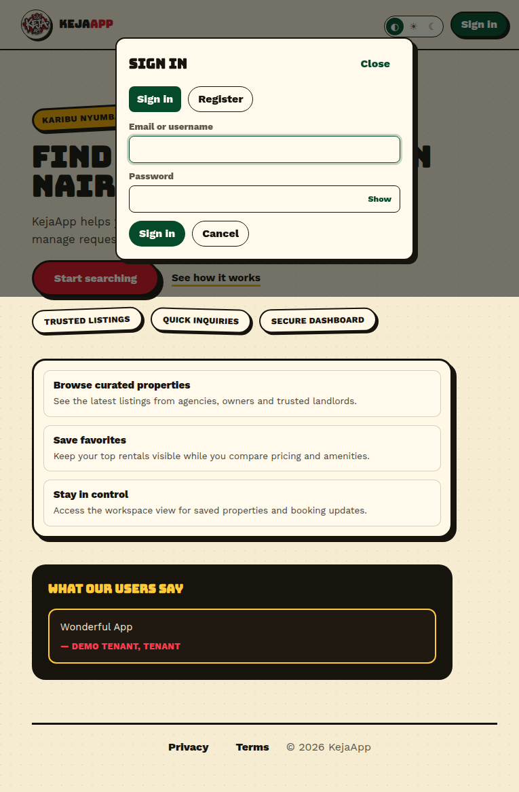
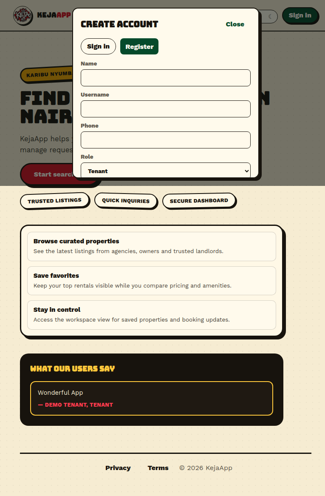

### Tenant dashboard

The tenant's home screen after signing in — activity counts across saved properties, inquiries, and viewings.

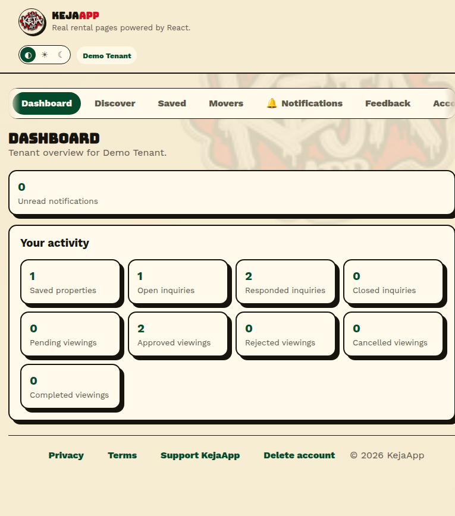

### Discover → property detail

Search/browse available rentals, then open a listing for full details, cost breakdown, and contact info. "Send inquiry" and "Request viewing" open modals from here (see Known limitations — not captured in this pass).

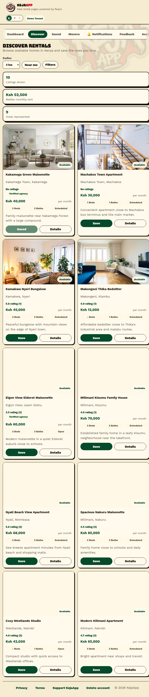
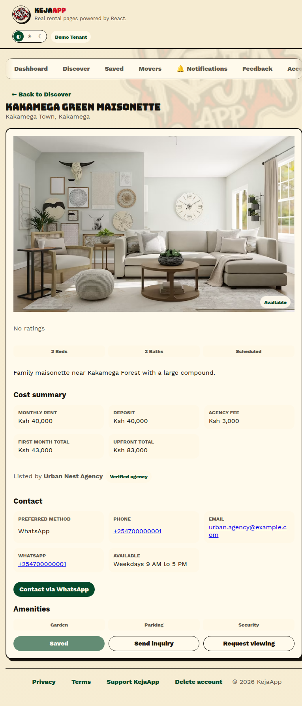

### Movers directory

Every role (including anonymous visitors) can browse and filter the mover directory.

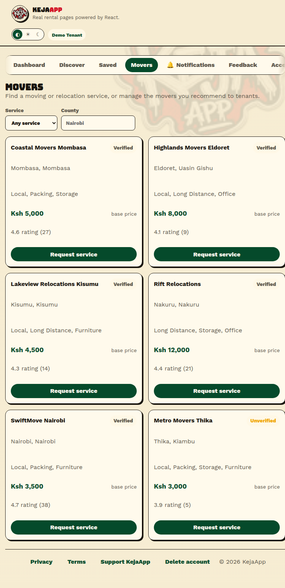

### Support KejaApp

The voluntary M-Pesa service-charge page — deliberately outside the inter-user Payment Boundary (see `CLAUDE.md`).

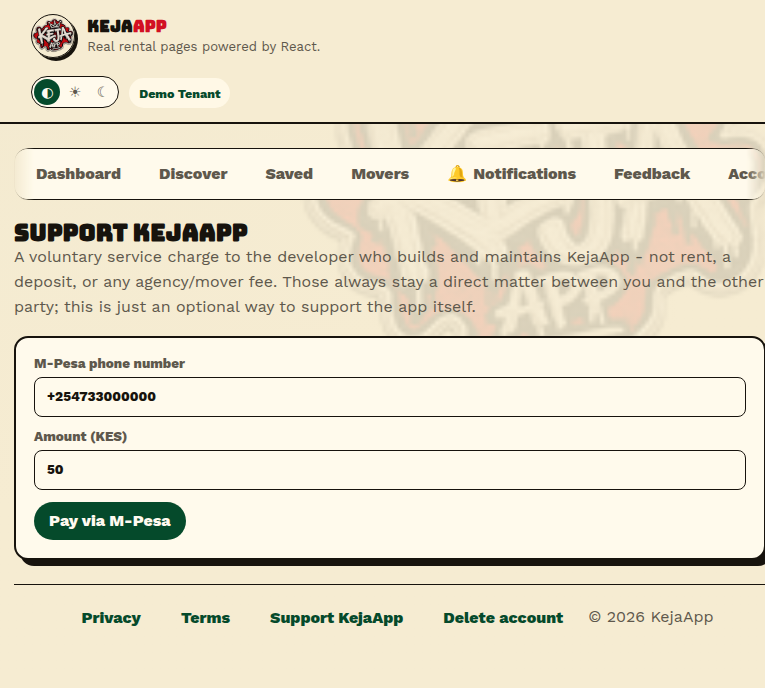

### Landlord workspace

Landlords/agencies land on the same Dashboard shell as tenants, but their signature tab is **Workspace**, not Discover — they manage only their own listings.

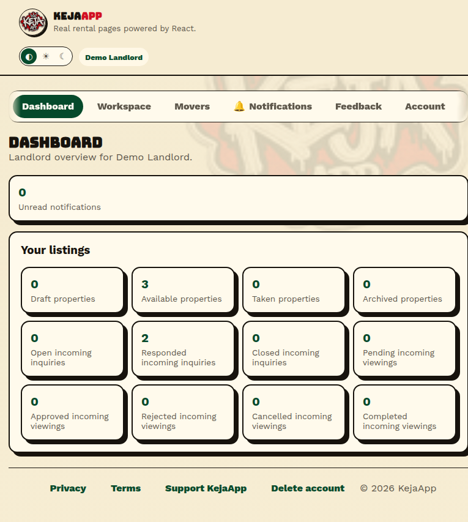
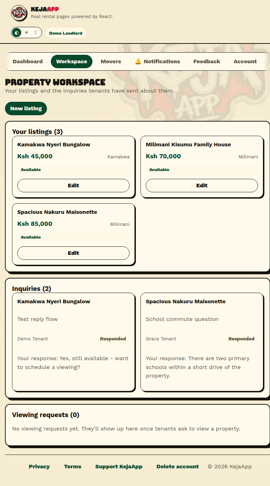

### Agency workspace

Same Workspace screen as landlord, showing a busier account (4 listings, open inquiries with the reply form expanded, viewing requests) to illustrate the fuller state.

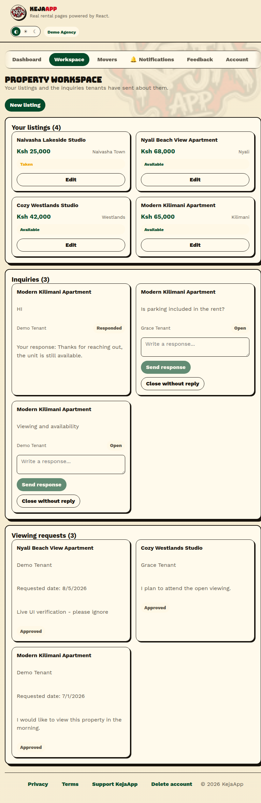

### Mover dashboard

A mover's own business profile plus every service request tenants have sent them, with accept/decline actions and computed pickup-to-drop-off distance/price estimates.

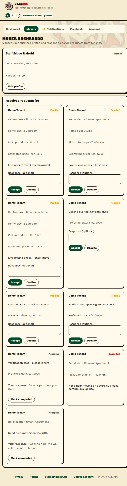

### Admin console

User account moderation only — no listing-management capability anywhere (enforced backend-side, not just hidden in the UI). Filtered to the Mover role here to avoid screenshotting real account data mixed into local seed data.

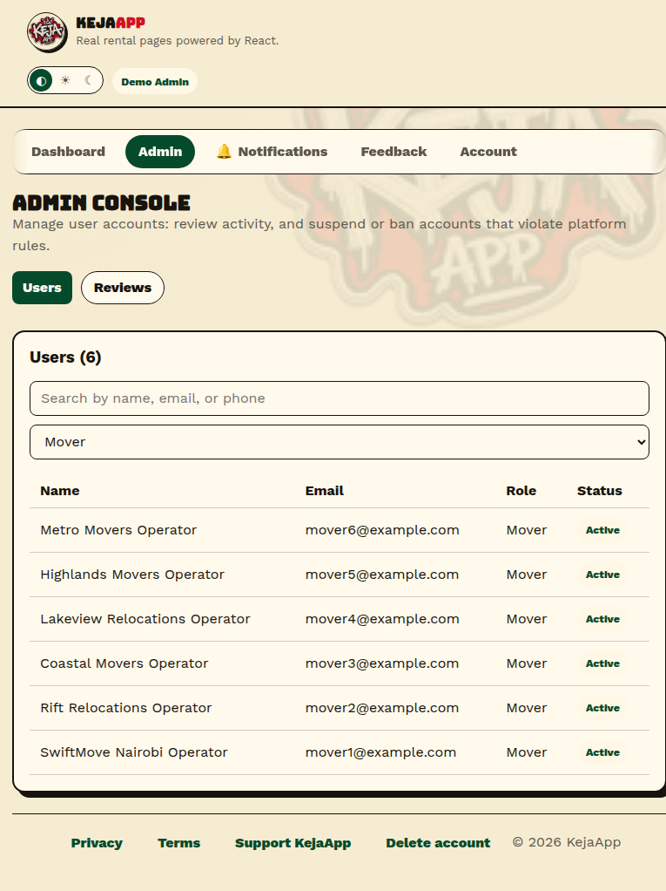

---

## Mobile

Captured via Expo's web preview at a phone-width viewport. The bottom tab bar is always exactly 3 tabs — two pinned per role, plus **More** holding everything else (see `Architecture.md`'s mobile navigation diagram for the full pinned/hidden breakdown per role).

### Dashboard (signed out) → More → Account

Anonymous visitors get Dashboard + Discover pinned; Movers and Account live behind More.

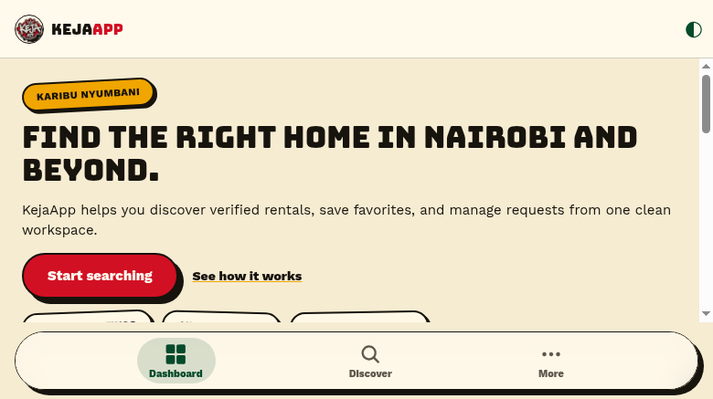
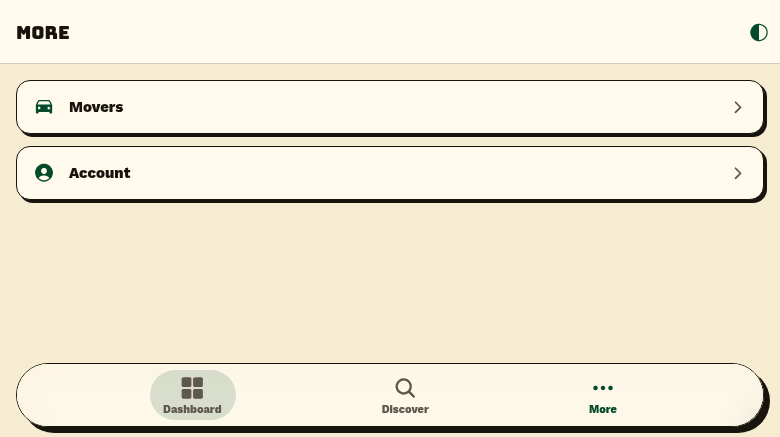
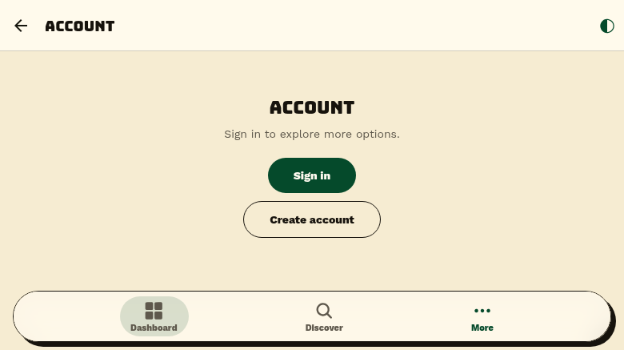

### Sign in / Register

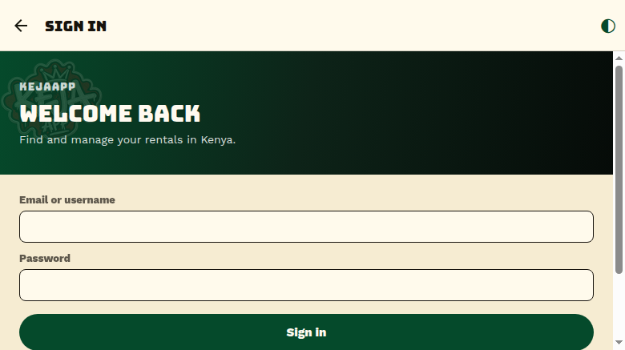
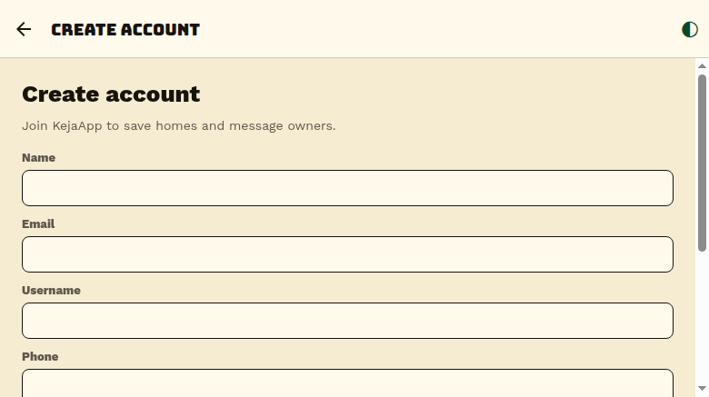

---

## Known limitations of this pass

Being upfront about what this method couldn't reliably capture, rather than presenting a misleadingly complete picture:

- **Mobile web-preview can't complete sign-in or load any API-backed screen.** `expo-secure-store` has no real implementation for the browser platform (`ExpoSecureStore.default.getValueWithKeyAsync is not a function`) — every token read/write throws, which blocks login and, since the shared request wrapper reads the stored token unconditionally, every subsequent API call too (Discover's listing, Dashboard's stats, etc. all show error states rather than real data in the web preview). This is a genuine constraint of testing via `react-native-web` specifically, not a bug in the app — it works correctly on a real device/emulator (Keychain/Keystore-backed), as already verified live earlier this project's history. Authenticated/data-backed mobile screens (tenant/landlord/agency/mover/admin dashboards, Discover results, property detail) aren't captured here as a result — the equivalent **web** screens above use the same design language and represent the same underlying data/flows.
- **The inquiry/viewing-request modals on the web Property Detail page aren't captured, and this is now confirmed to be a test-tooling artifact, not a product bug.** Clicking "Send inquiry"/"Request viewing" via headless-browser automation reached the correct, focusable button but never triggered the modal, reproduced across roughly a dozen attempts and several click methods, while other interactions on the same page worked fine. Root-caused with a temporary debug line (reverted immediately after) plus a direct DOM query: `document.querySelectorAll('form').length` stayed at `0` after a Playwright-synthesized click, but calling the native `HTMLButtonElement.click()` method directly on the exact same button - in the same test run, no code changes in between - correctly rendered the form (`formsAfterRaw: 1`). Since the application code (a plain `onClick` calling `setActiveForm`) is unambiguously correct and a raw DOM click reaches it fine, the gap is specifically in how this headless-automation setup synthesizes mouse events for these particular buttons, not anything a real user's mouse/touch input would hit.
- **iOS is entirely unrepresented** — no iOS device/simulator available in this environment, consistent with the rest of this project's testing history.
